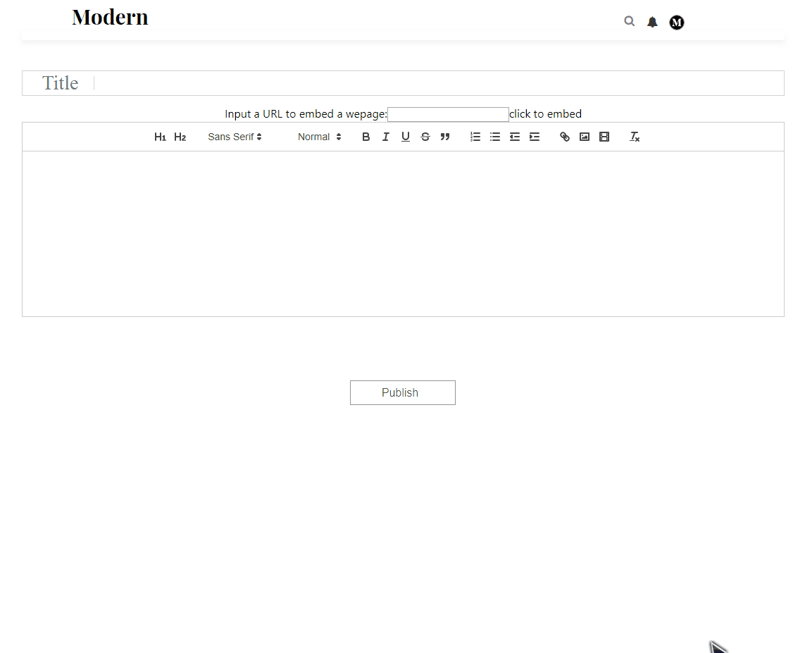

# Modern
Modern is a Medium clone, a publishing platform that contains a hybrid
collection of amateur and professional publications.
You can view the original website here: [Medium](https://medium.com)

## Technologies

* MongoDB
* Express
* React
* Node.js
* Redux
* Cloudinary DB
* LinkPreview API
* Quill

## Features

* Individual users can create accounts to sign with an email address. The Demo Modern button allows users to sign in without an account. 
* User authorization functionality allows the site to seemlessly restrict content based on login status.
* Stories can be created, read, updated, and deleted.
* Profiles can also be created, read
* A feed that shows published stories 
* Upload/delete profile picture 
* An intergrated editor that allows formatting/uploading pictures/embed url 
* Users can "clap" stories (similar to likes or upvotes) 
* Users can leave responses (comments) on stories 
* Actions such as creating publications and updating publications for logged in users only
* Interactive and responsive UI such as modal session form
* Search functionality for articles, authors, and a master command `all` to display all stories, with keyboard navigation 

## Code snippet example
1. The titles are parsed and stored in the database so when fetching the stories from the database, we have the hashes that can be used to compare with user inputs, allowing the user to search the story based on non-continuous characters.
2. A master command `*all*` that lists all stories in the database. 

```javascript
    matches() {
        const matches = [];
        if (this.state.inputVal.length === 0)
            return [];
        const input = this.state.inputVal;
        if(input === "*all*"){
            return Object.keys(this.props.hashesToCompare);
        }
        Object.keys(this.props.hashesToCompare).forEach(title => {
            for (let i = 0; i < input.length; i++) {
                if (!this.props.hashesToCompare[title][input[i]])
                    return [];
            }
            matches.push(title);
        });
        return matches;
    }
```

## Group Members
Team members:

* [Roger](https://github.com/yuichiu416)
* [Stan](https://github.com/stanbond)
* [Winnie](https://github.com/chinweenie)
