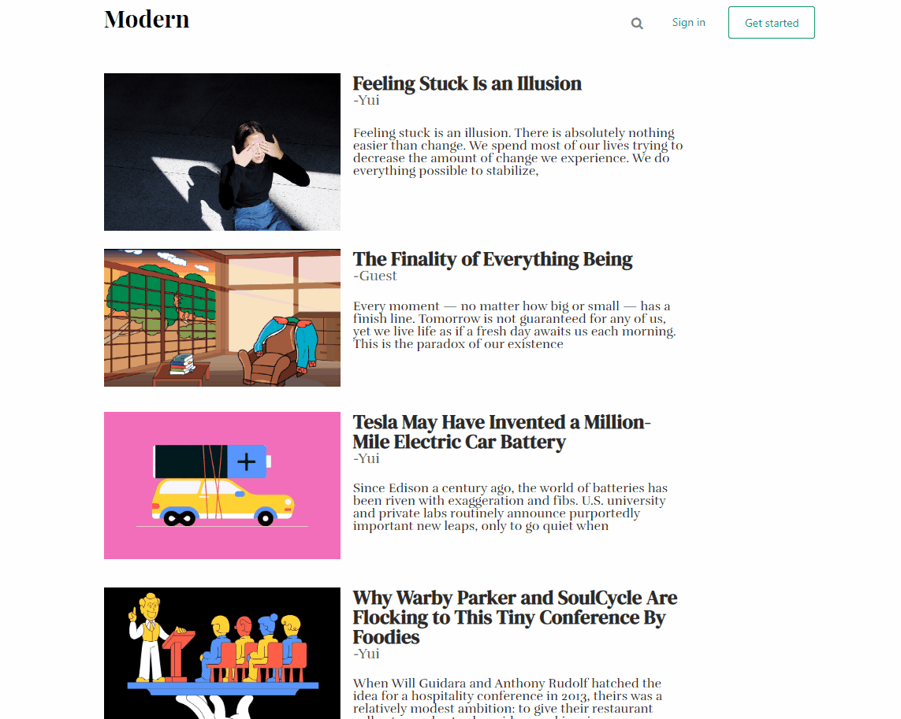
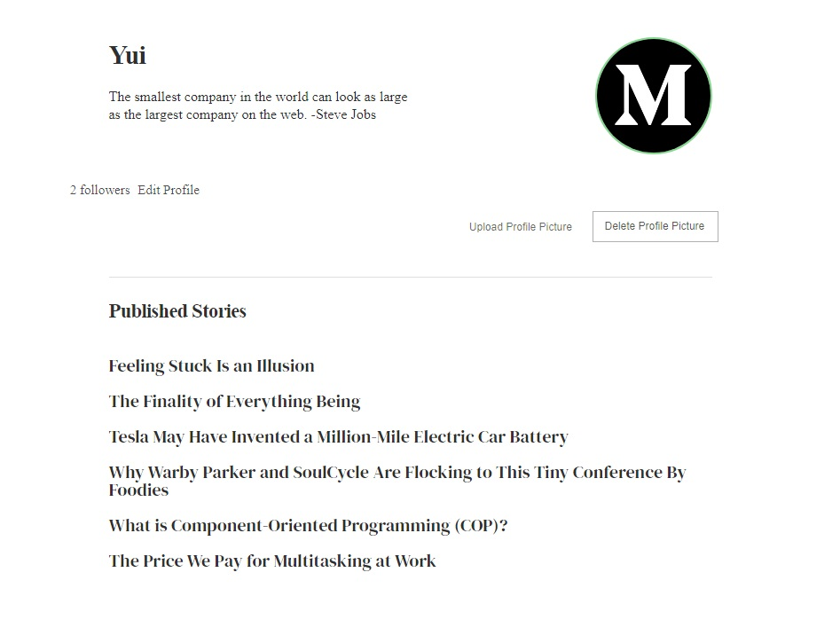
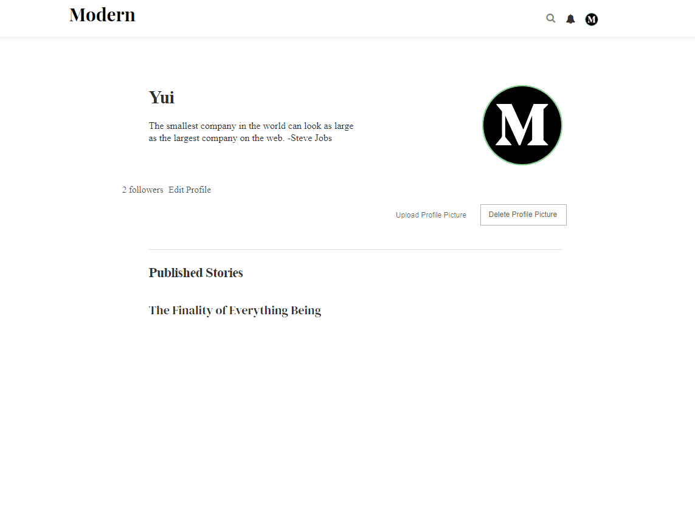
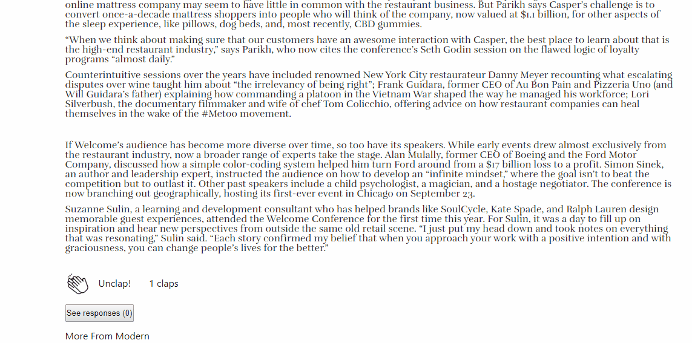
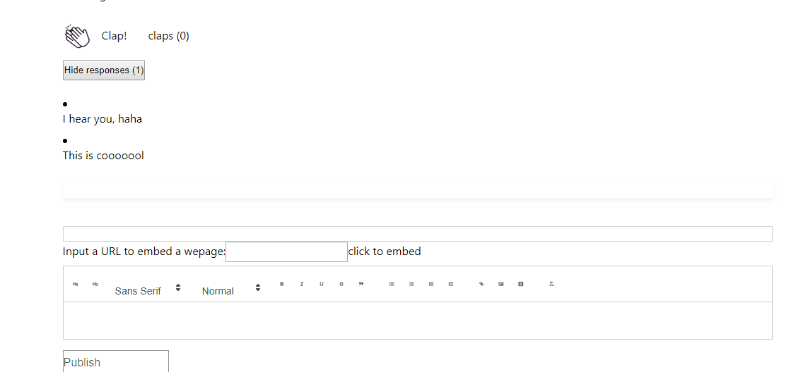
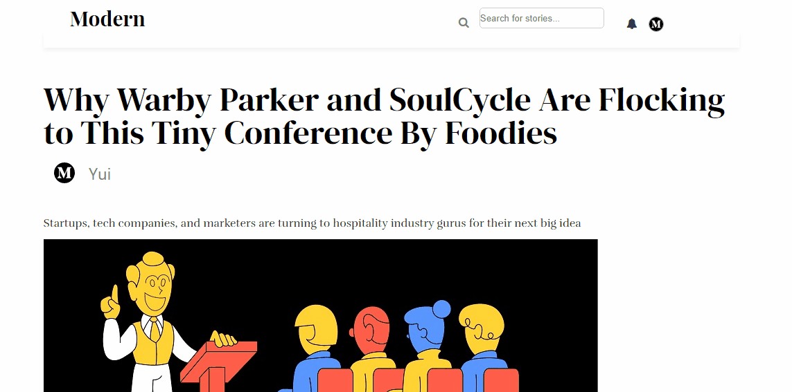

# Modern
Modern is a Medium clone, a publishing platform that contains a hybrid
collection of amateur and professional publications.
You can view the original website here: [Medium](https://medium.com)

[Live Demo](https://modern-5566.herokuapp.com/#/)

## Background and Overview
Modern taps into the brains of the world's most insightful writers, thinkers
and storytellers to bring you the smartest takes on topics that matter. So 
whatever your interest is, you can always find fresh thinking and unique 
perspectives.

We will need to:

* Make a MERN stack web app that allows users to login, signup and logout
* Build a Mongo database that store data of users, stories, comments, follows and claps, followers and followees
* Build responsive frontend components using React
* Make sure the communication between backend and frontend is instantaneous

## Functionality and MVP

* Individual users can create accounts to sign with an email address. The Demo Modern button allows users to sign in without an account.

* User authorization functionality allows the site to seemlessly restrict content based on login status.
* Stories can be created, read, updated, and deleted.
* Profiles can also be created, read
* A feed that shows published stories

* Upload/delete profile picture

  
* Users can "clap" stories (similar to likes or upvotes)

* Users can leave responses (comments) on stories

* Actions such as creating publications and updating publications for logged in users only
* Interactive and responsive UI such as modal session form
* Search functionality for articles, authors, and a master command `all` to display all stories, with keyboard navigation

## Technologies and Technical Challenges

* Backend: MongoDB, Express, Node.js
* Frontend: React

Technical challenges:

* Reading data from MongoDB and reorganize the data for frontend use
* Building a search functionality
* Implementing the logic for search functionality on users and publications
* Implementing joined table such as claps 

## Group Members and Work Breakdown
Team members:

* [Roger](https://github.com/yuichiu416)
* [Stan](https://github.com/stanbond)
* [Winnie](https://github.com/chinweenie)
* [Senyo](https://github.com/sdkag)

## Usage:
`npm install` in the root directory **AND** in the frontend directory

`npm run dev`